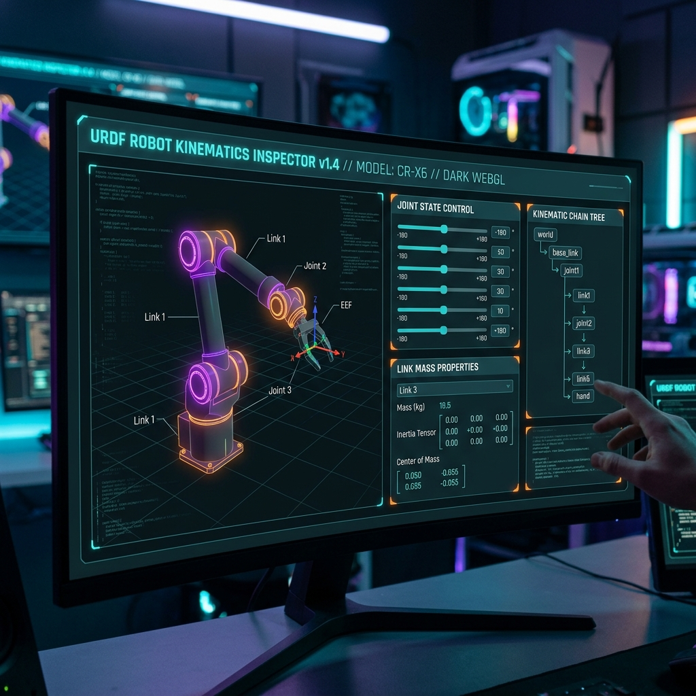
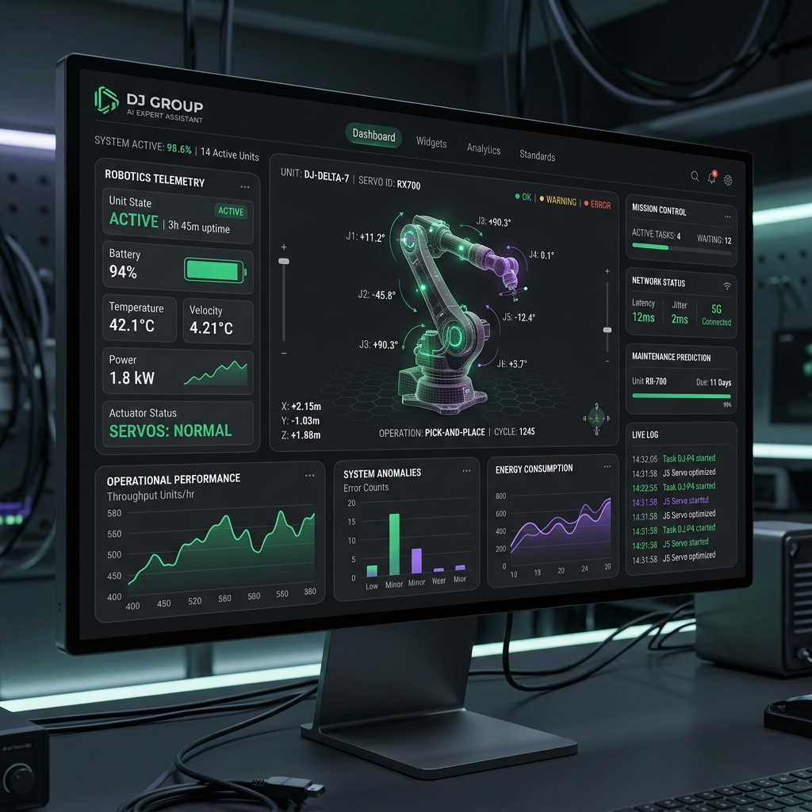
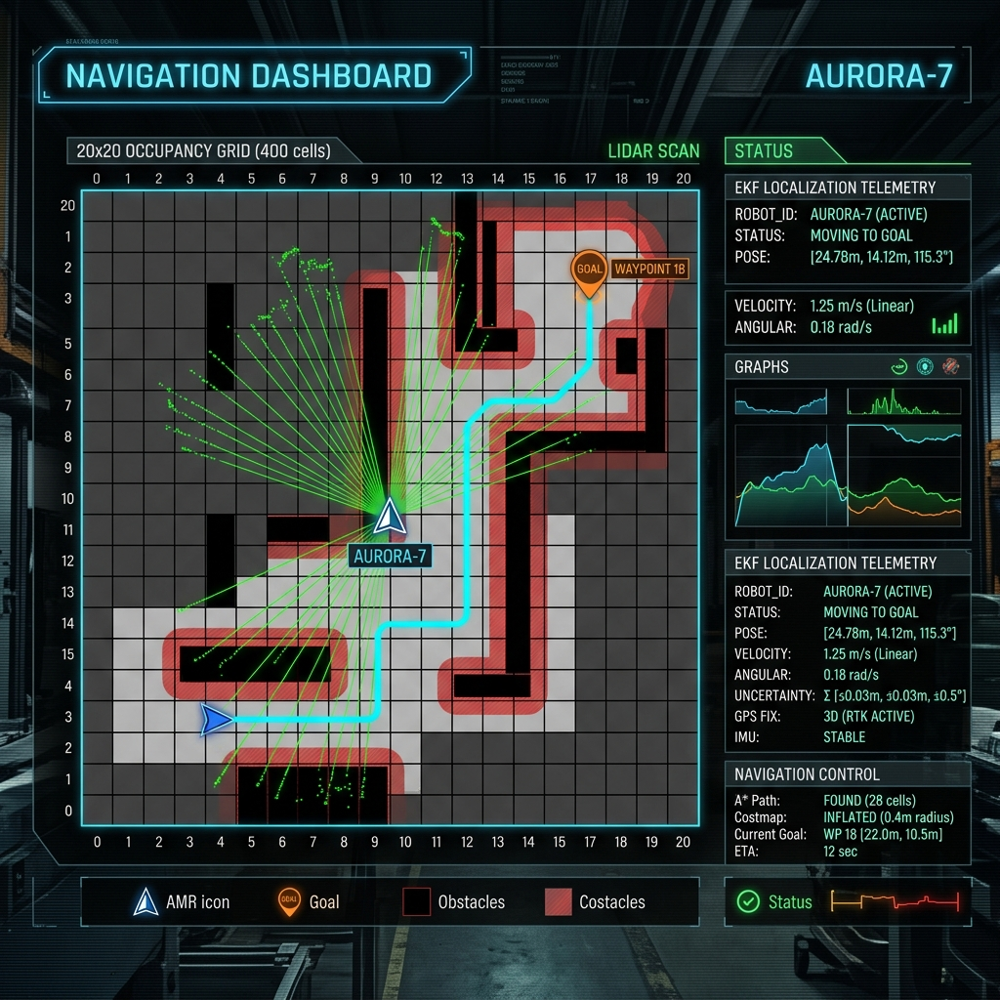
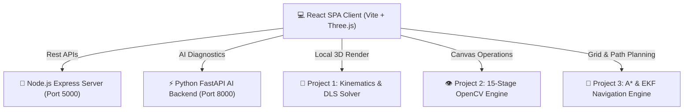

# DecodeLabs Internship Projects

[](#internship-submission-checklist)
[](#testing)
[](#testing)
[](#testing)
[](#-license)

---

## Overview

The **DecodeLabs Internship Project Suite** is an advanced, industrial-grade robotics engineering and artificial intelligence platform developed by **Dayyam Yashwanth**. The project integrates three primary engineering modules alongside a full AI Assistant knowledge platform:

1. 🦾 **Project 1 — Robotics Path Planner:** 6-DOF Articulated Robot Arm Kinematics & Motion Planning.
2. 👁️ **Project 2 — Automated Quality Inspection:** 15-Stage OpenCV Vision & Defect Detection Engine.
3. 🤖 **Project 3 — Autonomous Mobile Robot Navigation:** Occupancy Grid, A* (Manhattan Heuristic), EKF, LiDAR, Costmap Inflation, & Dynamic Obstacle Re-planning.

---

## Project 1 — Robotics Path Planner

### Features
- **6-DOF Articulated Arm Simulation:** Full kinematic representation of industrial robot arm joints.
- **Interactive Three.js 3D Viewport:** Real-time WebGL rendering with joint lighting, link meshes, and coordinate frames.
- **Forward Kinematics (FK):** Denavit-Hartenberg (DH) parameter transformation matrix calculations.
- **Inverse Kinematics (IK):** Damped Least Squares (DLS) numerical solver for target end-effector Cartesian poses.
- **Jacobian Matrix & Singularity Detection:** Yoshikawa Manipulability Index computation and real-time singular pose warnings.
- **Quintic Polynomial Trajectory Planning:** Smooth joint space velocity and acceleration profile generation.
- **Collision Detection & E-STOP:** Bounding sphere workspace collision checking and instantaneous emergency halt.
- **ROS 2 Simulation Architecture & Telemetry:** ROS-compatible joint state publishing format, JSON state export/import.

### Technology
- React 19, Three.js WebGL, Damped Least Squares IK Engine, Denavit-Hartenberg Matrix Solver.

### How to Run
```bash
npm run dev
# Open browser -> Sidebar -> Robotics Path Planner
```

### Screenshots


---

## Project 2 — Automated Quality Inspection

### Features
- **Flexible Image Source Input:** Supports live camera feed, local file upload, and synthetic dataset generation.
- **15-Stage OpenCV Computer Vision Pipeline:**
  1. *Read Image* → 2. *Grayscale* → 3. *Gaussian Blur* → 4. *Threshold* → 5. *Morphology* → 6. *Edge Detection (Canny)* → 7. *Contours* → 8. *Convex Hull* → 9. *Convexity Defects* → 10. *Bounding Box* → 11. *Dimension Measurement (mm Calibration)* → 12. *Shape Analysis* → 13. *Defect Detection* → 14. *Confidence Score (%)* → 15. *Final PASS / FAIL Disposition*.
- **Industrial Defect Classification:** Detects missing gear teeth, surface cracks, missing fasteners, and out-of-tolerance dimensions.
- **Multi-Format Analytics & Export:** Export inspection reports to **PDF**, **CSV**, **Excel**, and **JSON**.

### Technology
- HTML5 Canvas Processing Engine, Custom OpenCV-style Computer Vision Kernels, jsPDF, XLSX export.

### How to Run
```bash
npm run dev
# Open browser -> Sidebar -> Automated Quality Inspection
```

### Screenshots


---

## Project 3 — Autonomous Mobile Robot Navigation

### Features
- **AMR 20x20 Occupancy Grid Simulator:** Real-time grid-based world model with static walls and dynamic obstacles.
- **360° LiDAR Raycasting:** Real-time distance measurement sweeps detecting spatial boundaries and obstacles.
- **Extended Kalman Filter (EKF) Localization:** State estimation `[x, y, theta]` with covariance matrix calculation.
- **Transform Tree (TF):** Coordinate frame tree broadcasting (`map` → `odom` → `base_link` → `laser_frame`).
- **Custom A* Pathfinding Algorithm:** Employs **Manhattan distance heuristic** `|dx| + |dy|` for optimal route selection.
- **Global & Local Costmaps with Inflation Layers:** Exponential decay cost penalty around obstacles preventing collision.
- **Dynamic Obstacle Avoidance & Re-Planning:** Detects unexpected obstacles during motion, executes smooth deceleration, and dynamically re-plans new A* paths around obstacles.
- **Simulation Control & E-STOP:** Real-time speed slider, manual goal placement, and emergency motor kill switch.

### Interactive Browser Workflow
```text
START 
  ↓
SET GOAL (Click grid cell)
  ↓
PLAN PATH (Compute A* Manhattan Heuristic)
  ↓
START NAVIGATION (Robot begins path execution)
  ↓
ROBOT MOVES (LiDAR & EKF update continuously)
  ↓
DYNAMIC OBSTACLE (User spawns obstacle on active path)
  ↓
DECELERATION (AMR senses obstacle & slows down)
  ↓
REPLANNING (Re-evaluates costmap & calculates new path)
  ↓
NEW PATH (Resumes motion seamlessly)
  ↓
GOAL REACHED (Pose locked, success notification)
  ↓
RESET (Restores initial state)
```

### Technology
- Custom A* Search Engine, EKF State Estimator, 360° LiDAR Raycaster, React Canvas Grid.

### How to Run
```bash
npm run dev
# Open browser -> Sidebar -> AMR Autonomous Navigation
```

### Screenshots


---

## Technology Stack

| Domain | Stack |
|---|---|
| **Frontend Framework** | React 19, Vite 8, React Router 7, Vanilla CSS |
| **3D & Canvas** | Three.js (WebGL), HTML5 Canvas 2D Rendering |
| **Node Backend** | Node.js, Express 5 (Port 5000 REST API) |
| **Python AI Backend** | Python 3.14, FastAPI, Uvicorn (Port 8000 AI Grounding) |
| **Testing** | Pytest, ESLint 9 |

---

## Architecture



---

## Testing

Run complete backend test suite, linting, and production build verification:

```bash
# 1. FastAPI Pytest Suite (8/8 Passed)
python -m pytest backend_fastapi/tests

# 2. ESLint Code Quality Verification (0 Errors)
npm run lint

# 3. Production Vite Bundle Build
npm run build
```

---

## Documentation

Full technical specifications and verification reports are available in `/docs`:

- 📑 [PROJECT_DOCUMENTATION.md](docs/PROJECT_DOCUMENTATION.md)
- 🔗 [API_DOCUMENTATION.md](docs/API_DOCUMENTATION.md)
- 📌 [DECODELABS_SUBMISSION_CHECKLIST.md](docs/DECODELABS_SUBMISSION_CHECKLIST.md)

---

## Project Status

- ✅ **Code is working properly:** All components build and execute cleanly.
- ✅ **Project files are complete:** Full source tree for Project 1, 2, and 3 present.
- ✅ **GitHub Repository created & synced:** Synced across both `main` and `master` branches.
- ✅ **README file added & formatted:** Official DecodeLabs format.
- ✅ **Screenshots & Documentation prepared:** Complete markdown docs and visual previews.
- ✅ **Final project tested properly:** Pytest 8/8 passed, ESLint 0 errors, Vite build OK.

---

## Internship Submission Checklist

| Item | Requirement | Status |
|---|---|---|
| **Project 1** | Robotics Path Planner (6-DOF, FK/IK, Jacobian, Trajectory, E-STOP) | ✅ Complete |
| **Project 2** | Automated Quality Inspection (15-stage OpenCV, PASS/FAIL, PDF/Excel) | ✅ Complete |
| **Project 3** | AMR Navigation (LiDAR, Occupancy Grid, EKF, A*, Costmap, Re-planning) | ✅ Complete |
| **Backend** | Express (Port 5000) + FastAPI (Port 8000) Dual Microservices | ✅ Complete |
| **Testing** | Pytest 8/8, ESLint 0 Errors, Production Bundle Build | ✅ Complete |
| **Git Sync** | Remote repository synced (`origin/main` & `origin/master`) | ✅ Complete |

---

**Author:** Dayyam Yashwanth  
**Degree:** B.Tech Computer Science & Engineering (AI & ML)  
**Institution:** RGM College of Engineering and Technology  
**Repository:** [https://github.com/yyasjosh233-hub/DecodeLabs-Internship.git](https://github.com/yyasjosh233-hub/DecodeLabs-Internship.git)
