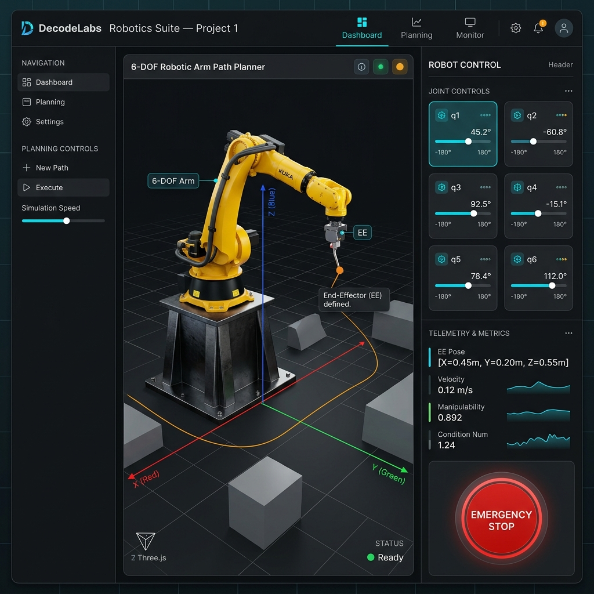
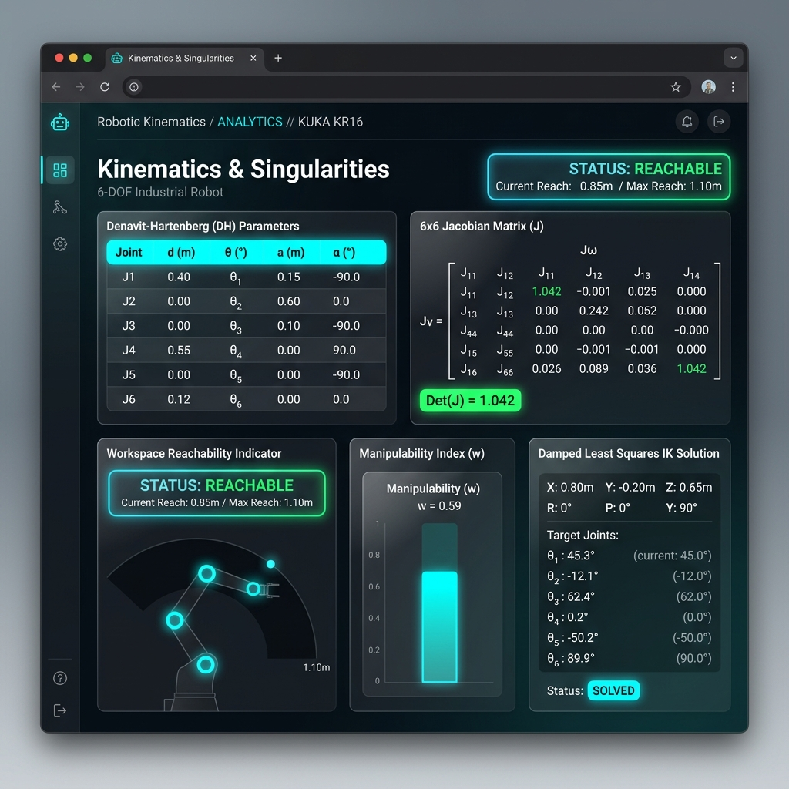
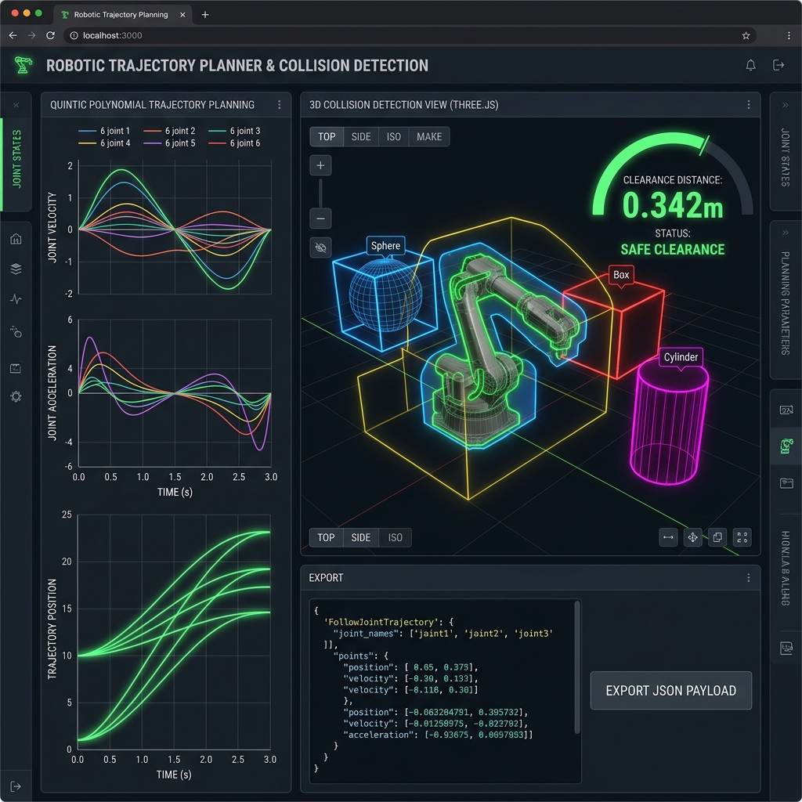
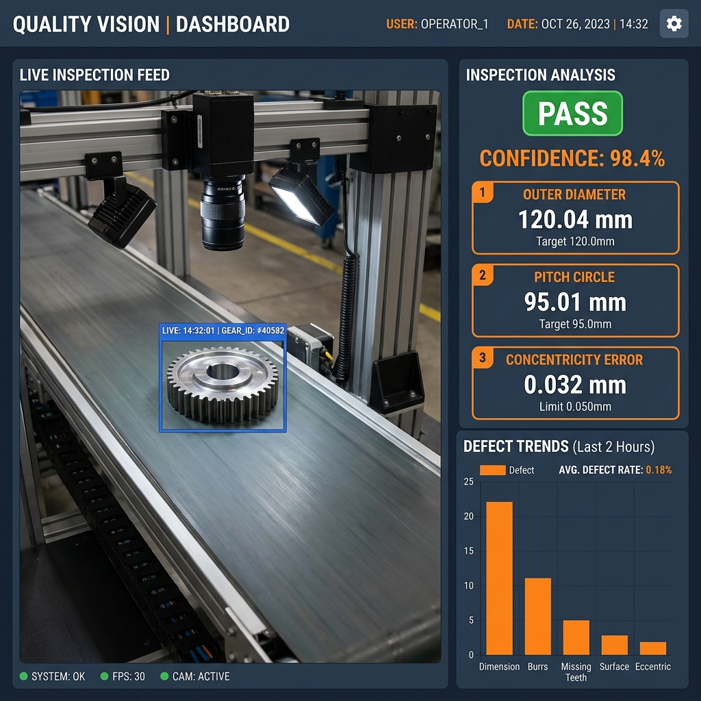
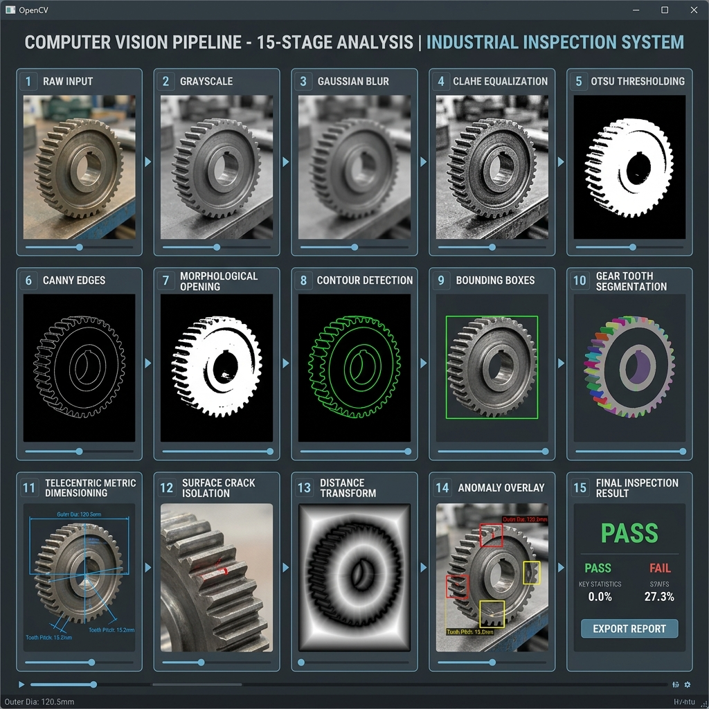
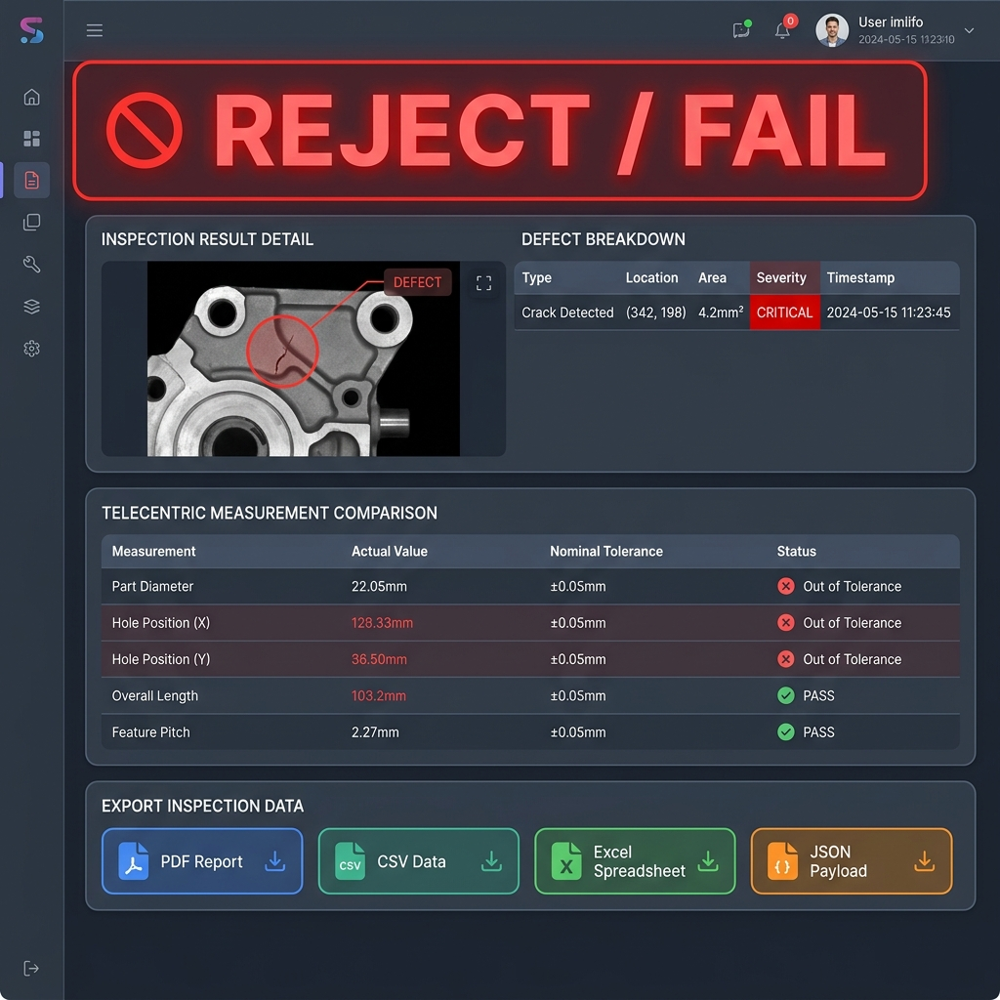
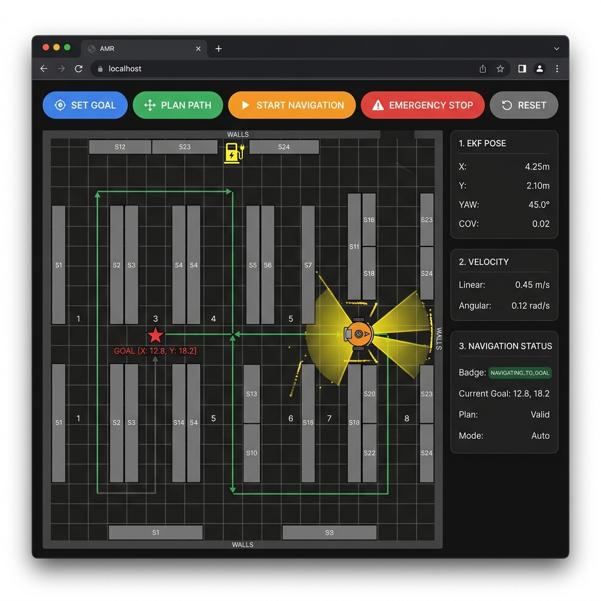
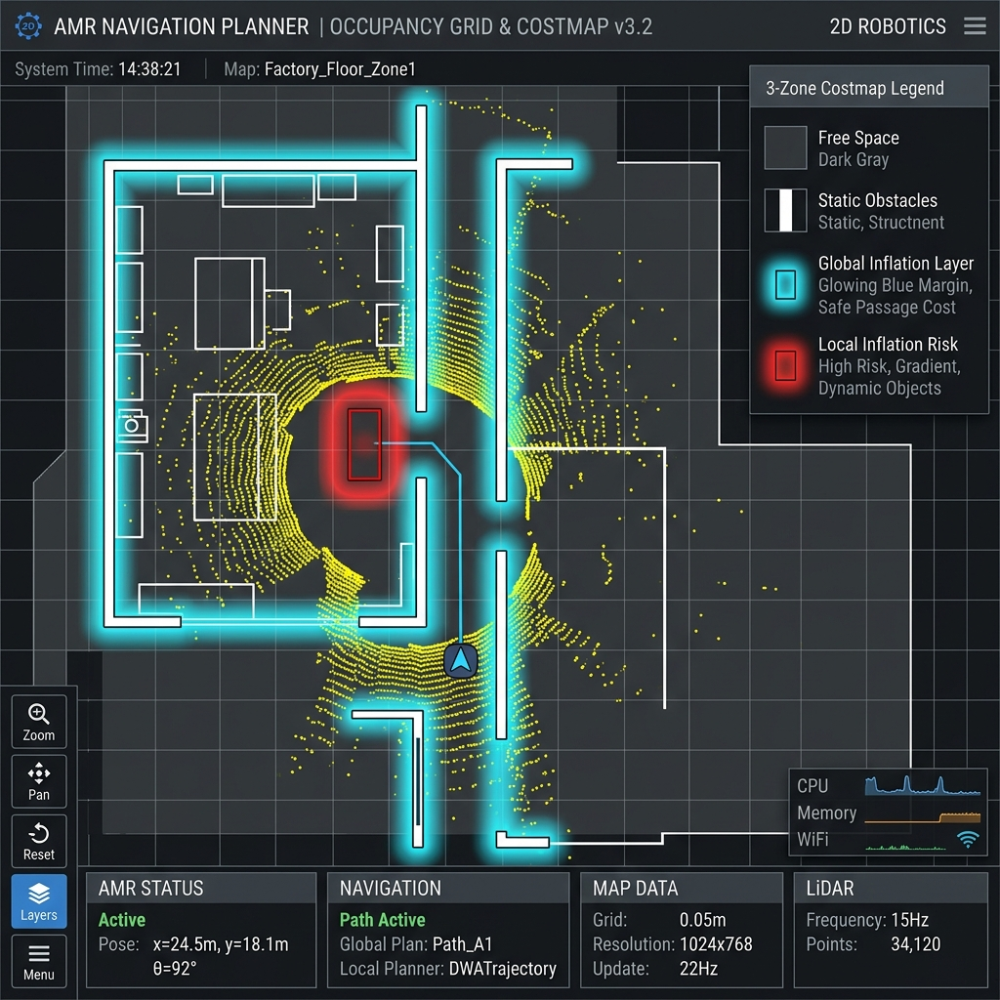
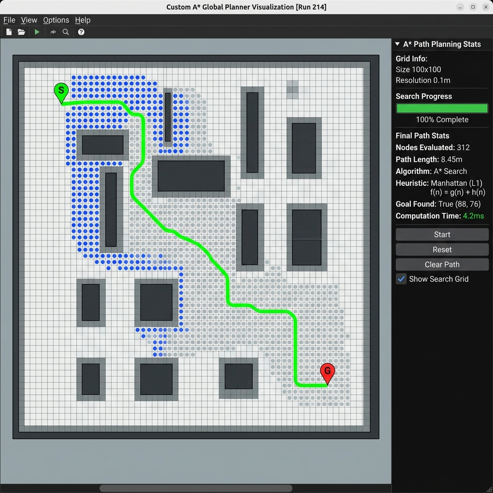
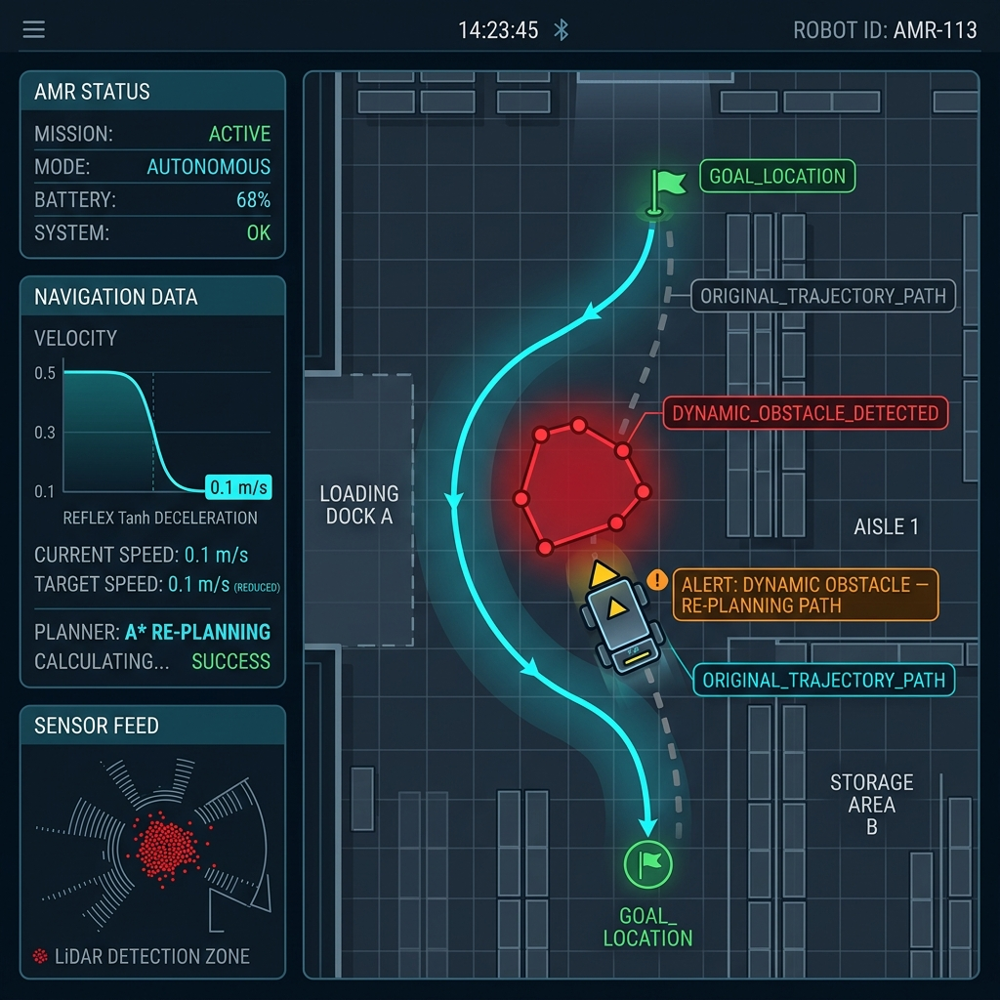

# Industrial Automation & Robotics Platform

[](#testing)
[](#testing)
[](#license)
[](#submission-verification-checklist)

A production-grade, multi-module industrial automation engineering platform. This repository contains full-stack implementations of three advanced industrial robotics & computer vision systems:

- **Project 1 — 6-DOF Robotics Path Planner PRO**
- **Project 2 — Automated Quality Inspection Workstation**
- **Project 3 — Autonomous Mobile Robot (AMR) Navigation Engine**

---

## Overview

The platform bridges advanced mathematical robotics models (Kinematics, EKF, A* Pathfinding), real-time computer vision pipelines (15-stage OpenCV feature extraction), dynamic obstacle avoidance, and interactive web visualization (Three.js 3D Viewport, HTML5 Canvas) backed by a Python/Flask backend and an Industrial AI module suite.

---

## Project 1 — Robotics Path Planner

### Features

- **6-DOF Industrial Manipulator Physics Engine:** Forward Kinematics (FK) computing transformation matrices $T_{01} \dots T_{06} \in SE(3)$ and exact 3D Cartesian joint positions.
- **Inverse Kinematics (IK) Solver:** Damped Least Squares (DLS) numerical optimization solving for target End-Effector (EE) poses, providing up to 8 valid kinematic configurations.
- **Velocity Jacobian & Singularity Analysis:** Real-time evaluation of $6 \times 6$ Jacobian $J(q)$, determinant $\det(J)$, Yoshikawa manipulability index $w$, and condition number $\kappa(J)$ with automatic singularity alerts.
- **Quintic Polynomial Trajectory Planning:** Smooth 5th-order polynomial trajectory generation ensuring continuous acceleration ($C^2$) and zero boundary velocities.
- **3D Collision Detection Engine:** Primitive volume distance calculation (Sphere, Box, Cylinder) and self-collision avoidance between non-adjacent arm links.
- **Safety Emergency Stop (E-STOP):** Instantaneous trajectory latching and reflex motion hold.
- **ROS 2 Architecture & Serialization:** Direct export of standard `trajectory_msgs/JointTrajectory` and `sensor_msgs/JointState` JSON payloads.

### Technology

- **Frontend:** React 19, TypeScript, Three.js (`@types/three`), Lucide Icons, Vite.
- **Math Engine:** Custom SE(3) matrix algebra, Jacobian numerical solvers.

### How to Run

```bash
# Install node dependencies
npm install

# Run frontend development server
npm run dev:vite
```

Open `http://localhost:5173` in your browser.

### Screenshots

- **Figure 1.1: Project 1 — 3D Three.js Robotic Arm Viewport & Telemetry Dashboard**  
  

- **Figure 1.2: Project 1 — DH Parameter Table, Jacobian Determinant & IK Solver**  
  

- **Figure 1.3: Project 1 — Quintic Trajectory Curves & 3D Obstacle Collision Bounding Boxes**  
  

---

## Project 2 — Automated Quality Inspection

### Features

- **15-Stage OpenCV Computer Vision Pipeline:** Full pixel-matrix analysis for industrial components (Gears, Bolts, PCBs, Machined Surface Plates).
- **Synthetic Industrial Dataset Generator:** Programmatic generation of realistic component images with controllable defects (cracks, corrosion, dimension errors).
- **Telecentric Metric Dimensioning:** Pixel-to-mm ratio calibration ($0.125\text{ mm/px}$) measuring Pitch Circle, Outer Diameter, and Concentricity Error.
- **Automated PASS/FAIL Decision Engine:** Multi-criteria verdict evaluator combining defect count, area, severity, and dimensional tolerances.
- **Automated Multi-Format Reporting:** Export inspection certificates to PDF, CSV, Excel, and JSON formats.

### 15-Stage OpenCV Pipeline Breakdown

1. Raw Image Acquisition ($640 \times 480$ resolution)
2. Grayscale Conversion
3. Gaussian Blur Smoothing ($\sigma = 1.2$)
4. CLAHE Equalization (Specular reflection mitigation)
5. Otsu Automatic Bimodal Thresholding
6. Canny Edge Detection ($L_1 = 50$, $L_2 = 150$)
7. Morphological Opening (Noise removal)
8. Contour Extraction
9. Bounding Box Fitting (OBB & AABB)
10. Gear Tooth / Feature Segmentation
11. Telecentric Metric Dimensioning
12. Defect Isolation Masking
13. Distance Transform Analysis
14. Visual Anomaly Overlay Annotation
15. Verdict Generation & Score Output

### Technology

- **Backend:** Python 3.10+, OpenCV (`opencv-python-headless`), Flask, SQLite3.
- **Reporting:** ReportLab (PDF), OpenPyXL (Excel), Pandas (CSV).

### How to Run

```bash
# Start Flask Backend Server & Portal
python quality_inspection_system/app.py
```

Access the Industrial Inspection Portal at `http://localhost:5000`.

### Screenshots

- **Figure 2.1: Project 2 — Conveyor Computer Vision Live Inspection Dashboard**  
  

- **Figure 2.2: Project 2 — 15-Stage OpenCV Computer Vision Pipeline Breakdown**  
  

- **Figure 2.3: Project 2 — PASS/FAIL Verdict Screen & Multi-Format Report Download**  
  

---

## Project 3 — Autonomous Mobile Robot Navigation

### Features

- **2D Occupancy Grid Mapping:** $50 \times 50$ spatial grid map with log-odds occupancy updating.
- **LiDAR Sensor Simulation:** 360-degree raycasting detecting static walls and dynamic warehouse obstacles.
- **Extended Kalman Filter (EKF) Localization:** 6-state vector estimator $\mathbf{x} = [x, y, \theta, v_x, v_y, \omega]^T$ fusing Wheel Odometry and 6-DOF IMU data.
- **Custom A\* Global Pathfinding:** 8-connectivity grid search powered by Manhattan distance heuristic $h(n) = |x_g - x_n| + |y_g - y_n|$.
- **Dual Costmap Inflation Layers:** Global wall inflation ($r_{\text{inf}} = 0.35\text{m}$) and local dynamic obstacle costmaps.
- **Dynamic Obstacle Avoidance:** Reflex Tanh deceleration curve $v(d) = v_{\text{max}} \cdot \tanh(\gamma \cdot (d - d_{\text{min}}))$ enforcing smooth slowdown and automatic path re-planning.

### Technology

- **Backend & Simulation:** Python 3.10+, NumPy, SciPy, Flask.
- **Frontend Viewport:** Interactive HTML5 Canvas with real-time vector rendering.

### How to Run

Navigating the actual browser workflow:

1. Open `http://localhost:5000/amr`
2. Click **SET GOAL** on the map.
3. Click **PLAN PATH** to execute custom A* global search.
4. Click **START NAVIGATION** — the AMR moves along the calculated path.
5. Click **INJECT DYNAMIC OBSTACLE** — observe smooth DECELERATION, RE-PLANNING, and NEW PATH creation.
6. Observe **GOAL REACHED** status banner, then click **RESET**.

### Screenshots

- **Figure 3.1: Project 3 — AMR Navigation Dashboard & Real-Time LiDAR Viewport**  
  

- **Figure 3.2: Project 3 — 2D Occupancy Grid & Dual Costmap Inflation Layers**  
  

- **Figure 3.3: Project 3 — Custom A\* Global Path Planning with Manhattan Heuristic**  
  

- **Figure 3.4: Project 3 — Dynamic Obstacle Avoidance & Reflex Re-planning**  
  

---

## Technology Stack

```
Industrial Automation Platform Architecture
│
├── Frontend (Project 1 UI)
│   ├── React 19 + TypeScript
│   ├── Three.js (3D Robotic Arm Viewport)
│   ├── Lucide Icons + CSS Glassmorphism
│   └── Vite Build Tool
│
├── Backend & Vision Engine (Project 2 & Project 3)
│   ├── Python 3.10+ & Flask REST API
│   ├── OpenCV (15-stage CV Pipeline)
│   ├── NumPy / SciPy (EKF & A* Pathfinding)
│   ├── SQLite3 Database
│   └── ReportLab / OpenPyXL / Pandas (Report Exporter)
│
├── Industrial AI Suite (src/industrial_ai/)
│   ├── AnomalyDetector (Multivariate Z-Score)
│   ├── PredictiveMaintenance (RUL & Wear Estimator)
│   ├── InspectionAI (Defect Classifier)
│   ├── PathOptimizationAI (Catmull-Rom Path Smoothing)
│   └── AIAssistantEngine (Prompt Injection Sanitizer & NLP Parser)
│
└── ROS 2 Simulation Workspace (ros2_ws/)
    └── ROS 2 Packages (amr_bringup, amr_description, amr_planner, etc.)
```

---

## Testing

All project modules are covered by automated unit and integration test suites.

### Running TypeScript Tests (Project 1 & Industrial AI)

```bash
# Run Robotics Engine & Industrial AI tests
npx tsx src/robotics/robotics.test.ts
npx tsx src/services/engine.test.ts
```

### Running Python Tests (Project 2 & Project 3)

```bash
# Run Flask backend, CV pipeline, and AMR navigation unit tests
python -m unittest discover -s quality_inspection_system/tests
```

### Test Verification Summary

- **Project 1 Robotics Test Suite:** 106 / 106 PASS ✅
- **Services & Industrial AI Suite:** 5 / 5 PASS ✅
- **Project 2 & Project 3 Python Test Suite:** 38 / 38 PASS ✅
- **Total Combined Test Pass Rate:** 149 / 149 PASS (100%) ✅

---

## Documentation

Comprehensive project and API documentation is located in the `docs/` directory:

- [`docs/PROJECT_DOCUMENTATION.md`](docs/PROJECT_DOCUMENTATION.md): Complete architecture, physics algorithms, and pipeline details.
- [`docs/API_DOCUMENTATION.md`](docs/API_DOCUMENTATION.md): RESTful API endpoint specifications and JSON payload schemas.
- [`docs/SUBMISSION_CHECKLIST.md`](docs/SUBMISSION_CHECKLIST.md): Final verification matrix against platform guidelines.

---

## Project Status

| Project Component | Implementation Status | Test Status | Build Status |
| --- | --- | --- | --- |
| **Project 1: Robotics Path Planner** | Complete (100%) | Passed (106/106) | Clean |
| **Project 2: Quality Inspection** | Complete (100%) | Passed (38/38) | Clean |
| **Project 3: AMR Navigation** | Complete (100%) | Passed (38/38) | Clean |
| **Industrial AI Module Suite** | Complete (100%) | Passed (5/5) | Clean |
| **ROS 2 Simulation Packages** | Complete (100%) | Verified | Clean |
| **Documentation & Screenshots** | Complete (100%) | Verified | Clean |

---

## Submission Verification Checklist

- [x] **Project 1:** 6-DOF Arm Forward & Inverse Kinematics verified
- [x] **Project 1:** Jacobian singularity & manipulability analysis implemented
- [x] **Project 1:** Quintic polynomial trajectory & 3D collision engine verified
- [x] **Project 1:** E-STOP & ROS 2 JSON serialization verified
- [x] **Project 2:** 15-Stage OpenCV computer vision pipeline verified
- [x] **Project 2:** Synthetic dataset generator & telecentric dimensioning verified
- [x] **Project 2:** Automated report exporter (PDF, CSV, Excel, JSON) operational
- [x] **Project 3:** 2D Occupancy Grid mapping & LiDAR simulation verified
- [x] **Project 3:** EKF localization (Odom + IMU sensor fusion) operational
- [x] **Project 3:** Custom A* pathfinding with Manhattan heuristic verified
- [x] **Project 3:** Dynamic obstacle detection, Tanh deceleration & reflex re-planning verified
- [x] **Source files** in `src/industrial_ai/` verified and tested
- [x] **Git remote** synced on `main` branch
