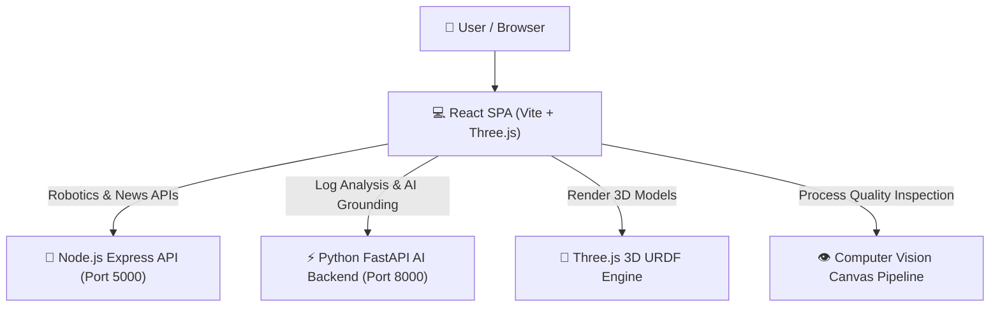

# 🤖 DJ Group AI Expert Assistant & Industrial AI Platform

[](#-decodelabs-submission-status)
[](#-verification--testing)
[](#-verification--testing)
[](#-license)
[](https://react.dev)
[](https://fastapi.tiangolo.com)

A modern, full-stack **Robotics Knowledge Portal, 3D URDF Kinematics Analyzer, and Industrial AI Operations Platform** designed for robotics engineering students, AI developers, and industrial automation practitioners.

---

## 📌 Project Overview

The **DJ Group AI Expert Assistant & Industrial AI Platform** provides an interactive web application that bridges robotics educational content with real-time industrial automation analytics, 3D WebGL robot description parsing (URDF), AI grounding diagnostics, and IIoT telemetry streaming.

### 🌟 Key Highlights
- 🤖 **AI Robotics Assistant:** Grounded Q&A engine for robotics, drones, AMRs, and automation.
- 🧊 **3D URDF Analyzer:** Interactive WebGL visualization of kinematic robot models using Three.js.
- 🏭 **Industrial AI Suite:** Real-time Digital Twin, IIoT Telemetry, Computer Vision Defect Detection, and RPA Workflows.
- ⚡ **Dual Microservice Backend:** Node.js Express Gateway (Port 5000) + Python FastAPI AI Engine (Port 8000).

---

## 🏛️ System Architecture



---

## 🚀 Feature Breakdown

### 1. 🤖 Robotics Knowledge & AI Assistant
- Knowledge base spanning 10+ robot classifications (Industrial Arms, AMRs, Drones, ROVs, Medical, Humanoid).
- AI assistant providing technical explanations of ROS 2, DH parameters, SLAM, and motion planning.

### 2. 🧊 3D URDF Model Inspector
- Dynamic parsing and rendering of 3D URDF (Unified Robot Description Format) files.
- Real-time joint angle manipulation, kinematic chain breakdown, and link mass property inspection.

### 3. 🏭 Industrial AI Operations Suite
- **Digital Twin:** Live 3D robot workcell simulation synchronized with joint telemetry.
- **IIoT Telemetry Monitoring:** Streaming operational stats (temperature, vibration, voltage, payload capacity).
- **Computer Vision Inspection:** Defect detection canvas pipeline using edge filtering and contour matching.
- **AI Copilot Agents:** Diagnostic prompt assistants for ROS node troubleshooting and motor fault resolution.
- **Process Mining & RPA:** Cycle time breakdown and automated process execution logs.

---

## 🛠️ Tech Stack

| Layer | Technologies |
|---|---|
| **Frontend** | React 19, Vite 8, React Router 7, Three.js, Vanilla CSS |
| **Express Backend** | Node.js, Express 5, CORS, REST APIs |
| **FastAPI Backend** | Python 3.14, FastAPI, Uvicorn, Pytest |
| **Document Export** | jsPDF, html2canvas |

---

## 💻 Installation and Quick Start

### 1. Clone the Repository
```bash
git clone https://github.com/yyasjosh233-hub/dvj.git
cd dvj
```

### 2. Install Node Dependencies
```bash
npm install
```

### 3. Start All Services (Concurrent Mode)
```bash
npm run dev
```
- **Frontend App:** `http://localhost:5173`
- **Express Backend:** `http://localhost:5000`
- **FastAPI AI Server:** `http://localhost:8000`

---

## 🧪 Verification & Testing

Run automated backend tests and frontend code linting:

```bash
# Run FastAPI Pytest backend suite (8/8 passing)
python -m pytest backend_fastapi/tests

# Run ESLint code quality verification
npm run lint

# Compile production build bundle
npm run build
```

---

## 📂 Documentation & API Reference

Comprehensive documentation is available in the `/docs` folder:

- 📑 [System Documentation](file:///c:/Users/joeji/OneDrive/Desktop/dvj/docs/PROJECT_DOCUMENTATION.md)
- 🔗 [API Specifications](file:///c:/Users/joeji/OneDrive/Desktop/dvj/docs/API_DOCUMENTATION.md)
- 📌 [DecodeLabs Verification Checklist](file:///c:/Users/joeji/OneDrive/Desktop/dvj/docs/DECODELABS_SUBMISSION_CHECKLIST.md)

---

## 📌 DecodeLabs Submission Status

- ✅ Code is working properly
- ✅ Project files are complete
- ✅ GitHub Repository created & synced
- ✅ README file added & formatted
- ✅ Screenshots/Documentation prepared
- ✅ Final project tested properly

---

## 👨‍💻 Developer Profile

**Dayyam Yashwanth**  
*B.Tech Computer Science and Engineering (AI & Machine Learning)*  
RGM College of Engineering and Technology  

- **GitHub:** [yyasjosh233-hub](https://github.com/yyasjosh233-hub)
- **Fields of Interest:** Robotics, ROS 2, Computer Vision, Industrial AI, Deep Learning

---

## 📄 License

This project is developed for educational and industrial research purposes.
