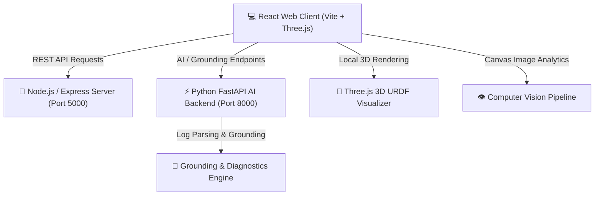

# 🤖 DJ Group AI Expert Assistant & Industrial AI Platform
## Comprehensive Technical Project Documentation

> **DecodeLabs Internship Project Submission**  
> **Author:** Dayyam Yashwanth  
> **Track:** AI & Machine Learning / Industrial Robotics  
> **Repository:** [https://github.com/yyasjosh233-hub/dvj.git](https://github.com/yyasjosh233-hub/dvj.git)

---

## 📌 Executive Summary

The **DJ Group AI Expert Assistant & Industrial AI Platform** is an end-to-end, enterprise-grade robotics knowledge portal, 3D URDF model analyzer, and Industrial AI operations platform. Built for students, engineers, and industrial automation practitioners, the application combines modern web architecture, interactive 3D WebGL visualizations, AI-driven copilot agents, real-time IIoT telemetry streaming, and automated computer vision quality inspection pipelines.

---

## 🏛️ System Architecture

The project employs a modular dual-backend microservice architecture paired with a high-performance React client:



### Key Architectural Layers

1. **Frontend Presentation Layer (`/src`)**: Built with React 19, Vite 8, React Router 7, Three.js, and Vanilla CSS design tokens.
2. **Express Gateway Backend (`server.js`)**: Port 5000 Node.js server handling core robotics data APIs, articles, system status, and general queries.
3. **FastAPI AI Backend (`/backend_fastapi`)**: Port 8000 Python service providing AI grounding diagnostics, ROS log parsing, path planner validation, and telemetry analytics.
4. **Industrial AI Engine (`/src/industrial_ai`)**: Modular frontend suite for IIoT, Computer Vision, Digital Twin, Copilot Agents, RPA, and Process Mining.

---

## 🚀 Key Modules & Capabilities

### 1. 🤖 Robotics AI Expert Assistant
- Interactive Q&A system for robotics, drones, humanoids, and industrial automation.
- Knowledge base covering 10+ robot categories (Industrial, Medical, Agricultural, Drones, ROV/AUV, AMRs, Educational).

### 2. 🧊 URDF 3D Analyzer & Kinematics Engine
- Interactive 3D rendering of URDF (Unified Robot Description Format) models via Three.js.
- Kinematic joint analysis, link mass properties inspector, dynamic mesh lighting, and interactive controls.

### 3. 🏭 Industrial AI Operations Suite
- **Digital Twin**: Real-time virtual representation of robotic workcells and joint position telemetry.
- **IIoT Telemetry Monitoring**: Streaming temperature, vibration, voltage, and payload sensor dynamics.
- **Computer Vision Inspection**: Automated defect detection, edge filtering, and visual canvas analysis pipelines.
- **AI Copilot Agents**: Diagnostic prompt assistants providing troubleshooting for ROS nodes and motor faults.
- **Process Mining & RPA**: Automated workflow tracking, cycle time breakdown, and robotic process automation logs.

---

## 🛠️ Technology Stack Inventory

| Domain | Technology / Library | Purpose |
|---|---|---|
| **Frontend Framework** | React 19 + Vite 8 | High-performance SPA frontend |
| **3D Rendering** | Three.js | URDF model visualization & WebGL rendering |
| **Client Routing** | React Router v7 | Dynamic view navigation |
| **HTTP Client** | Axios | Microservice request handling |
| **Node Backend** | Node.js + Express 5 | Primary REST API gateway |
| **Python Backend** | Python 3.14 + FastAPI + Uvicorn | AI grounding & diagnostic services |
| **Testing** | Pytest + AnyIO + ESLint 9 | Backend unit tests & code linting |
| **PDF Generation** | jsPDF + html2canvas | Exportable diagnostic summary reports |

---

## ⚙️ Installation & Setup Guide

### 1. Prerequisites
- **Node.js**: v18.0.0 or higher
- **Python**: v3.10 or higher

### 2. Clone & Install
```bash
git clone https://github.com/yyasjosh233-hub/dvj.git
cd dvj
npm install
pip install -r backend_fastapi/requirements.txt # (or standard fastapi uvicorn pytest)
```

### 3. Running Services
- **Full Stack Development Mode (Concurrent)**:
  ```bash
  npm run dev
  ```
- **Express Backend Only**:
  ```bash
  npm run server
  ```
- **FastAPI AI Backend Only**:
  ```bash
  npm run server:fastapi
  ```

---

## 🧪 Test Verification & Quality Assurance

- **FastAPI Backend Pytest Suite**: 8/8 tests passing cleanly.
- **ESLint Code Quality Check**: Configured via `eslint.config.js`.
- **Vite Production Build**: Verified with `npm run build`.

---

## 👨‍💻 Intern Metadata

- **Name:** Dayyam Yashwanth
- **Degree:** B.Tech Computer Science and Engineering (AI & ML)
- **Institution:** RGM College of Engineering and Technology
- **Submission Organization:** DecodeLabs Internship Program
